# Introduction

BoundaryFace's motivation is partially  inspired by NPT-Loss [Arxiv](https://arxiv.org/ftp/arxiv/papers/2103/2103.03503.pdf). Due to the different research's line and the fact that BoundaryFace is not based on the innovation of NPT-Loss,  we do not consider to cite NPT-Loss and compare it with BoundaryFace in this paper.

The differences with NPT-Loss are：

- Solving different problems for face recognition:  NPT-Loss addresses the shortcomings of metric loss in face recognition, such as combinatorial explosion; and has the effect of implicitly hard-negative mining. BoundaryFace solves the shortcomings of margin-based softmax in face recognition; BoundaryFace focus on hard samples directly and can tolerate closed-set noise simultaneously.
- The motivation (idea)  is different: NPT-Loss compresses the distance between the sample and ground truth class center while increasing the distance between the sample and the nearest negative class center by using a form of proxy triplet. BoundaryFace first considers closed-set noise.  Starting from the perspective of decision boundary, based on the premise of closed-set noise label correction, the framework directly emphasizes hard sample features that are located in the margin region.  Obviously, the NPT-Loss is still heavily disturbed by noise samples.
- The final loss functions are different: NPT-Loss is an proxy-triplet's form with hyper-parameter free. BoundaryFace is the margin-based softmax form, and still has hyper-parameters.

Now, for academic rigor, we have added related work to the original paper.  See link at  [Arxiv](https://arxiv.org/pdf/2210.04567.pdf)

# Quick Start

## Training environment

Experiment based on WebFace (in paper):

|     OS     |   GPU    | Python | CUDA | torch | torchvision |
| :--------: | :------: | :----: | :--: | :---: | :---------: |
| Windows 10 | 1 TitanX | 3.7.0  | 9.0  | 1.1.0 |    0.3.0    |

packages: `requirements_ct.txt`


Experiment based on MS1M / MS1MV2:

|  OS   |     GPU      | Python | CUDA | pytorch | torchvision |
| :---: | :----------: | :----: | :--: | :-----: | :---------: |
| Linux | 8 * RTX 3070 | 3.7.0  | 11.3 | 1.10.0  |   0.11.0    |

packages: `requirements_dt.txt`

## Dataset

**For Training Set:**   [InsightFace](https://github.com/deepinsight/insightface/tree/master/recognition/_datasets_)

- CASIA-WebFace
- MS1M [addr](https://www.microsoft.com/en-us/research/project/ms-celeb-1m-challenge-recognizing-one-million-celebrities-real-world/)
- MS1MV2

**For Testing Set:** [InsightFace](https://github.com/deepinsight/insightface/tree/master/recognition/_datasets_):

- LFW
- AgeDB-30
- CFP-FP
- CALFW
- CPLFW
- SLLFW
- RFW [Wang et al.](http://www.whdeng.cn/RFW/testing.html)
- MegaFace


## Train

> Please modify the relevant path parameters by yourself in advance. (such as the save path of closed-set noise etc.)


**For training CASIA-WebFace and noisy synthetic datasets, we use 1 NVIDIA TitanX GPU with batch size of 64. **

- noisy synthetic datasets is made by `utils/generate_label_flip.py` and `utils/generate_outlier_update.py`
  - Artificially synthesized datasets: The same proportion of noise, due to  the different selection of noise samples and differences in the distribution of noise samples may lead to some differences in the test results with the paper, **but does not affect the conclusions in paper and README.md**.

```shell
visdom
python ./training_mode/conventional_training/train.py
```


**For training MS1M / MS1MV2, we use  8 * 3070 GPU with batch size of  8 * 32 **

|    Dataset    | backbone | total epoch | milestone | epoch_start |  m   |  s   |
| :-----------: | :------: | :---------: | :-------: | :---------: | :--: | :--: |
| MS1M / MS1MV2 | Res50-IR |     24      | 10,18,22  |     10      | 0.5  |  32  |


```shell
tensorboard --logdir ./training_mode/distributed_training/MS1M_tensorboard
python -m torch.distributed.launch --nproc_per_node=8 --nnodes=1 --node_rank=0 --master_addr="127.0.0.1" --master_port=1324 ./training_mode/distributed_training/train_DDP.py
```


## Additional remarks

**Note on open-set noise in paper:**

Even though our method is for closed-set noise, experiments related to open-set noise are still performed.

In particular, we do not align open-set  noise samples (Only resize to 112 * 112 when used).

The main reason is as follows：

> In our initial experiments, we used open-set noise from distractors in the megaface dataset provided by insightface. However, during training, these aligned noisy samples may cause the training to crash. When we introduce only 20% of these open-set noise samples in the original WebFace, the accuracy of the model on the test set may occur as follows (Even if the m of ArcFace is reduced or softmax head is used):
>
> 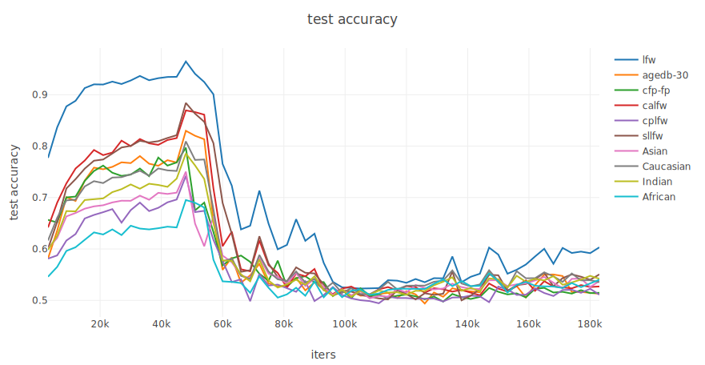 
>
> This is incompatible with the situation caused by open-set noise in the real environment. The open set noise rate contained in MS1M is much higher than 20%, but the training process is still normal. The reasons for this problem, we think there may be two: 
>
> - The distribution of the simulated open-set noise samples may be very different from the distribution in the real environment.
> - The number of samples in WebFace is too small, if it is IMDB-Face or other Datasets may not appear this situation. 
>
> Such a bad situation does not occur if the unaligned samples are used as open-set noise sources, so this approach is used in the paper to simulate open-set noise in the real environment.


## Supplemental Results

Due to resource and time constraints, the method is not tested on the real dataset MS1M in our paper, which leads to a lower confidence level of the method. We understand if the paper was ultimately rejected for this reason, but the reviewers and the AC ultimately accepted our paper.

`In this subsection, we will supplement the experiments of our method on MS1M and provide all the data and files saved during the training process for your reference.`


### Visualization Results

#### Closed-set noise corrected by our method in WebFace

> The list of closed-set noise corrected during training is here[7dzp](https://pan.baidu.com/s/1VGio3-EsWeFY2-UDElLRfw).

**Example 1:**

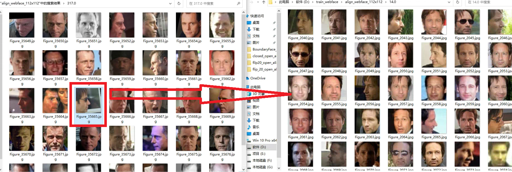 


**Example 2:**

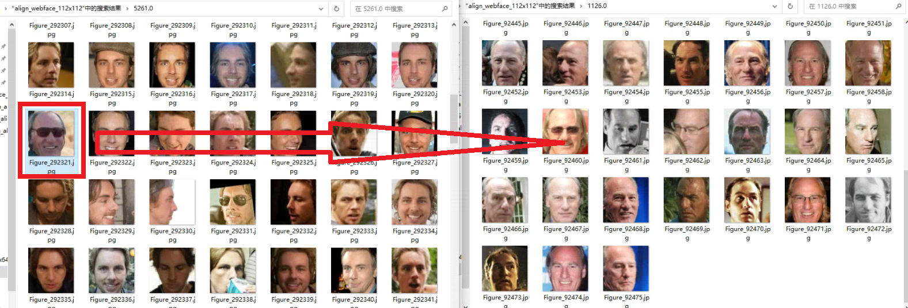 


**Example 3:**

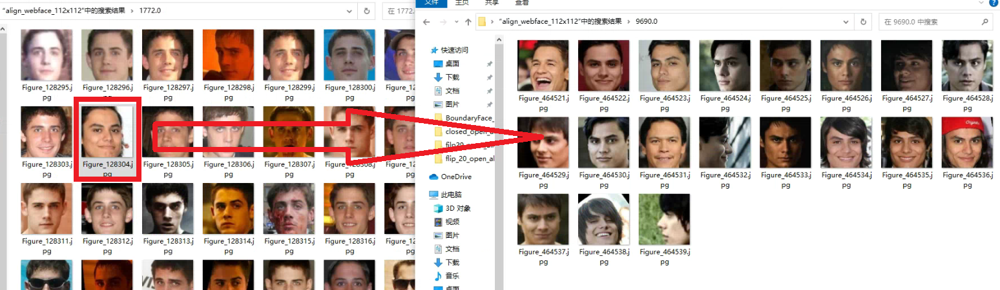 


**Example 4:**

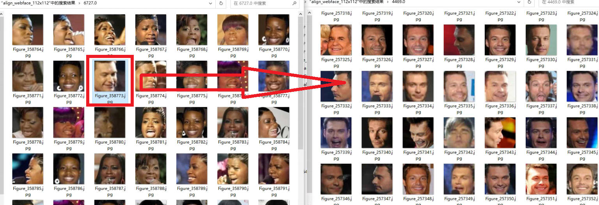 


#### Closed-set noise corrected by our method in MS1M

> MS1M is very noisy, and whether a sample is closed-set noise or not is entirely discerned by our method itself.
>
> - The closed-set noise label self-correction module is essentially based on model's generalization capability.

**Example 1:**

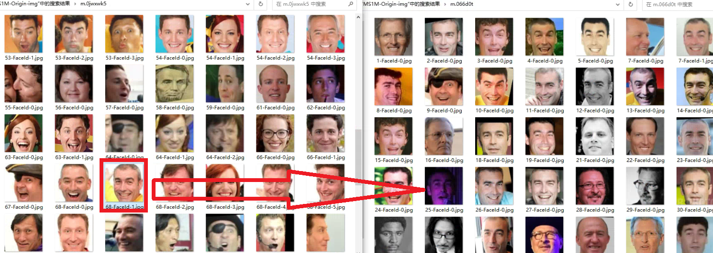 


**Example 2:**

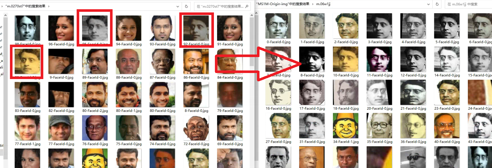 


**Example 3:**

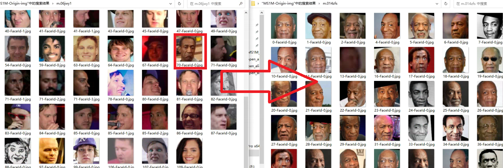 


#### Closed-set noise corrected by our method in MS1MV2

> Even if MS1MV2 is considered as a clean dataset, our method still finds a small amount of closed-set noise.

**Example 1:**

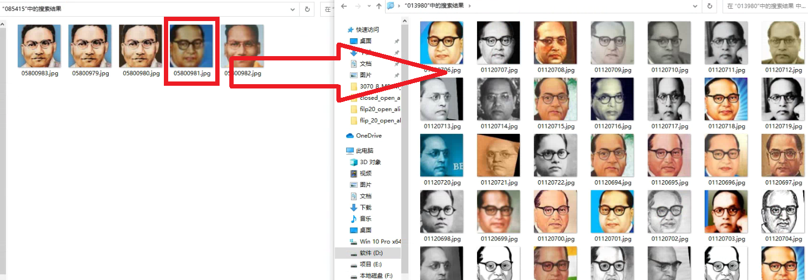 


**Example 2:**

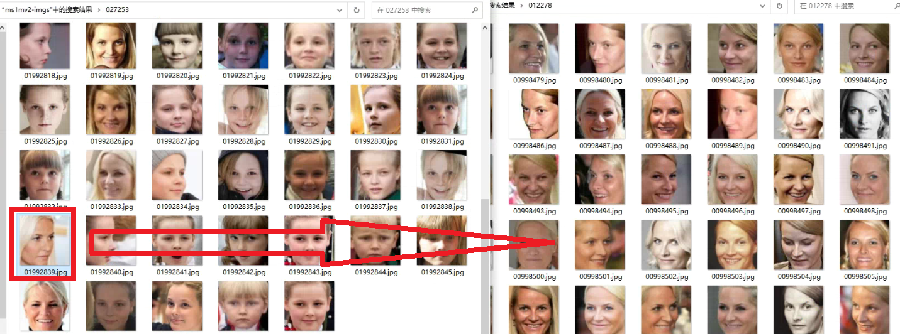 


**Example 3:**

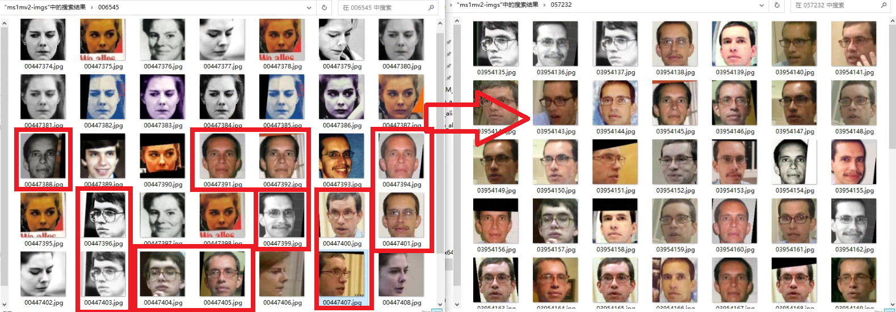 


### Test Results

> ***Note:***
>
> - All training logs and intermediate files on MS1M / MS1MV2 can be found here [pqff](https://pan.baidu.com/s/1bZnFjb_rVQZ68XDDioY_Kw).
> - All results reported in the tables are the performance at last epochs.
> - Test environment is 8 * RTX 3070 Pytorch 1.10.0 

**Training Set: MS1M**

IJB-C： 1:1 TAR @FAR=1e-4

|       Method       | MegaFace(R)@Rank1 | IJB-C     |    LFW    | AgeDB-30  |  CFP-FP   |   CALFW   |   CPLFW   |   SLLFW   |   Asian   | Caucasian |  Indian   |  African  |
| :----------------: | :---------------: | --------- | :-------: | :-------: | :-------: | :-------: | :-------: | :-------: | :-------: | :-------: | :-------: | :-------: |
|      ArcFace       |       96.45       | 91.65     |   99.7    |   97.55   | **96.43** |   95.92   |   91.53   |   99.3    |   95.13   |   98.4    |   96.75   |   96.02   |
|   MV-Arc-Softmax   |       96.86       | 91.47     | **99.72** |   97.72   |   96.4    |   95.85   | **92.02** |   99.28   |   95.15   | **98.42** |   96.73   |   96.33   |
|   CurricularFace   |       95.82       | 90.78     |   99.7    |   97.48   |   96.17   |   95.65   |   91.82   |   99.1    |   93.77   |   97.97   |   95.73   |   95.52   |
| BoundaryFace (λ=0) |     **97.57**     | **91.74** |   99.6    |   97.77   |   96.34   | **95.95** |   91.98   |   99.25   |   95.03   |   98.37   | **96.85** |   96.15   |
| BoundaryFace (λ=π) |       97.53       | 30.14     |   99.68   | **97.82** |   94.53   |   95.92   |   87.2    | **99.33** | **95.17** |   98.37   |   96.4    | **96.43** |

As can be seen from the table above, BoundaryFace(λ=π) performs very poorly on IJB-C even though it outperforms the baseline on MegaFace. We believe that the possible reasons are, on the one hand, that the hyper-parameter π is not applicable to BoundaryFace in real large-scale noisy datasets, and on the other hand, it may be caused by the excessive attention to open-set noise in the method itself. We will explore this problem in the future.


**Training Set: MS1MV2**

|       Method       | MegaFace(R)@Rank1 | IJB-C     |    LFW    | AgeDB-30  |  CFP-FP   |   CALFW   |   CPLFW   |   SLLFW   |   Asian   | Caucasian |  Indian   |  African  |
| :----------------: | :---------------: | --------- | :-------: | :-------: | :-------: | :-------: | :-------: | :-------: | :-------: | :-------: | :-------: | :-------: |
|      ArcFace       |       97.31       | **94.51** |   99.72   | **98.03** | **95.89** | **95.92** |   91.7    |   99.42   |    97     |   99.1    |   97.52   | **97.95** |
| BoundaryFace (λ=π) |     **97.41**     | 94.49     | **99.75** |   97.98   |   95.63   |   95.9    | **91.83** | **99.52** | **97.38** | **99.22** | **97.63** |   97.93   |


## Some conclusions

- Even though MS1M contains a lot of open-set noise, the performance of baseline on it does not degrade too much, and the training process does not crash.
- When dataset's noise rate is high, using BoundaryF1 (==BoundaryFace's special form (λ=0)==) can get good results.
- When dataset's noise rate is high, BoundaryFace(λ=π)'s performance on the CFP-FP and CPLFW  is much degraded  (It is also reflected in the paper, C 30 O 10) and the test curve fluctuates greatly during training. We believe this may be due to the distribution of noisy data or excessive noise rate causing problems in model learning.  We will explore the reasons for this in the future.
- When the dataset's noise rate is low (e.g. MS1MV2), using BoundaryFace can further improve performance.


# Todo

- Decrease the balance factor λ in formula to train BoundaryFace on MS1M / MS1MV2


# Acknowledgements

- BoundaryFace's motivation is partially  inspired by NPT-Loss  [Arxiv](https://arxiv.org/ftp/arxiv/papers/2103/2103.03503.pdf). And thanks the authors for their excellent work. 

- This code is largely based on [FaceX-Zoo](https://github.com/JDAI-CV/FaceX-Zoo) and [**Face_Pytorch**](https://github.com/wujiyang/Face_Pytorch). We thank the authors a lot for their valuable efforts.